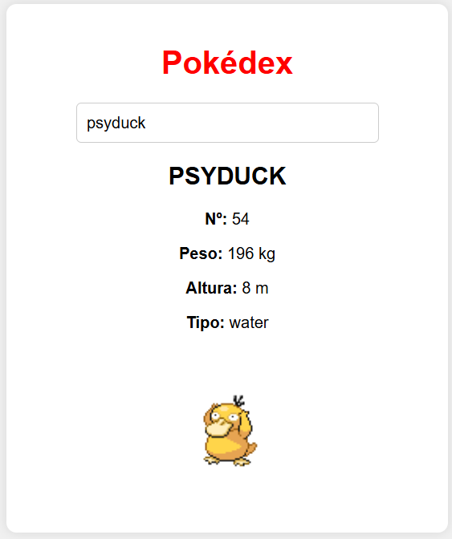
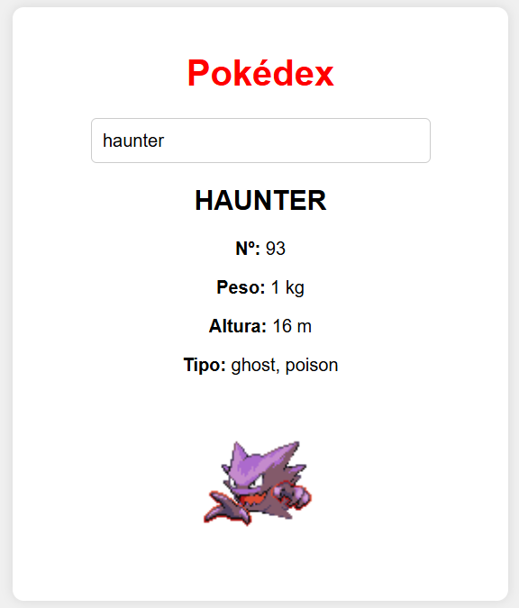

# Pokédex React

Este é um projeto simples de Pokédex feito com **React.js**, consumindo a **PokéAPI** para exibir informações sobre qualquer Pokémon.

## 📌 Funcionalidades
✅ Busca de Pokémon por nome  
✅ Exibição de ID, altura, peso e tipos  
✅ Imagem oficial do Pokémon  

---

## 🚀 Como instalar e rodar o projeto

### 1️⃣ Clonar o repositório
```bash
git clone https://github.com/Rodrigoscast/Pokedex-Web.git
cd Pokedex-Web
```

### 2️⃣ Instalar dependências
```bash
npm install
```

### 3️⃣ Rodar o projeto
```bash
npm start
O app será aberto em http://localhost:3000/.
```

### 🛠️ Tecnologias utilizadas
React.js ⚛️
Fetch API 📡
CSS3 🎨

### 📜 Estrutura do projeto
```bash
📂 Pokedex
 ┣ 📂 aula
 ┃ ┣ 📂 src
 ┃ ┣ 📜 App.js       # Componente principal
 ┃ ┣ 📜 style.css    # Estilos da Pokédex
 ┃ ┗ 📜 index.js     # Arquivo de entrada
 ┣ 📜 README.md      # Documentação
 ┗ 📜 .gitignore     # Ignorar arquivos desnecessários
```

### 🌐 Link para acessar o projeto
https://pokedex-project-web.netlify.app/

### 🎨 Imagens do projeto final




